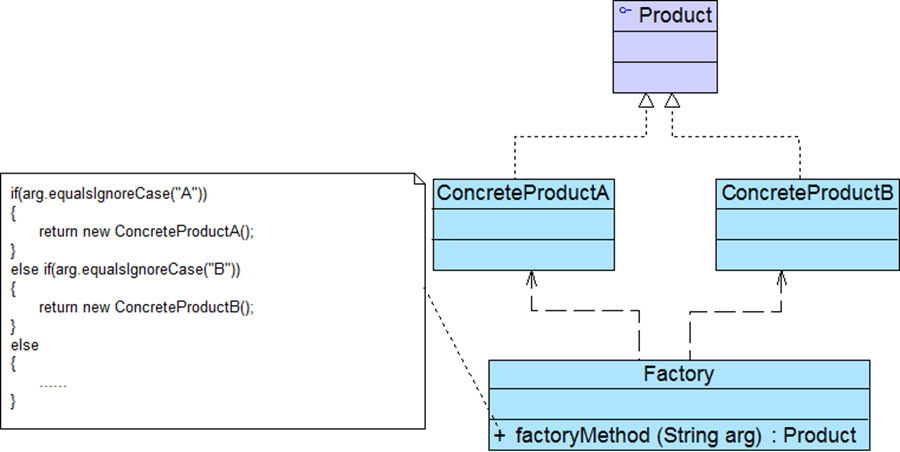
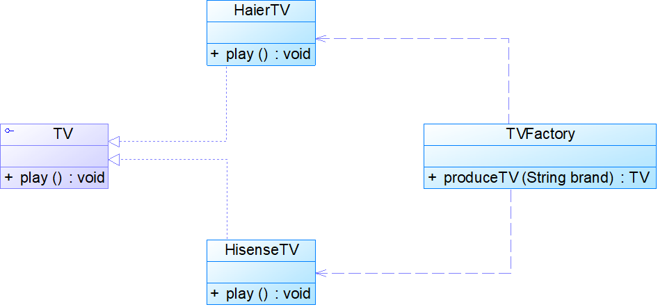

# 简单工厂模式


<!--more-->

## 模式动机

只需要告知水果名称就可以得到相应的水果：


## 模式定义

简单工厂模式(Simple Factory Pattern)：又称为静态工厂方法(Static Factory Method)模式，它属于类创建型模式

在简单工厂模式中，可以根据参数的不同返回不同类的实例

简单工厂模式专门定义一个类来负责创建其他类的实例，被创建的实例通常都具有共同的父类

## 模式结构



## 模式分析

- 将对象的创建和对象本身业务处理分离可以降低系统的耦合度，使得两者修改起来都相对容易
- 在调用工厂类的工厂方法时，由于工厂方法是静态方法，使用起来很方便，可通过工厂类类名直接调用，只需要传入一个简单的参数即可，无须知道对象的创建细节
- 可以将参数保存在XML等格式的配置文件中，修改时无须修改任何Java源代码
- 问题：工厂类的职责相对过重，增加新的产品需要修改工厂类的判断逻辑，违背开闭原则

## 代码示例

某电视机厂专为各知名电视机品牌代工生产各类电视机，当需要海尔牌电视机时只需要在调用该工厂的工厂方法时传入参数“Haier”，需要海信电视机时只需要传入参数“Hisense”，工厂可以根据传入的不同参数返回不同品牌的电视机。现使用简单工厂模式来模拟该电视机工厂的生产过程。



抽象产品接口：

```java
public interface TV {
    public void play();
}
```

具体产品类：

```java
public class HairTV implements TV {
    @Override
    public void play() {
        System.out.println("海尔电视播放中、、、、、");
    }
}
```

```java
public class HisenseTV implements TV {
    @Override
    public void play() {
        System.out.println("海信电视播放中、、、");
    }
}
```

工厂类：

```java
public class TVFactory {
    public static TV produceTV(String type) throws Exception {
        if(type.equalsIgnoreCase("Hair")){
            return new HairTV();
        }else if(type.equalsIgnoreCase("Hisense")){
            return new HisenseTV();
        }else{
            throw new Exception("对不起，不支持的电视类型");
        }
    }
}
```

客户端：

```java
public class Client {
    public static void main(String args[]) {
        TV tv;
        try {
            tv=TVFactory.produceTV("Hair");
            tv.play();
        } catch (Exception e) {
            e.printStackTrace();
        }
    }
}
```

## 优点

- 实现了对象创建和使用的分离
- 客户端无须知道所创建的具体产品类的类名，只需要知道具体产品类所对应的参数即可
- 通过引入配置文件，可以在不修改任何客户端代码的情况下更换和增加新的具体产品类，在一定程度上提高了系统的灵活性

## 缺点

- 工厂类集中了所有产品的创建逻辑，职责过重，一旦不能正常工作，整个系统都要受到影响
- 增加系统中类的个数（引入了新的工厂类），增加了系统的复杂度和理解难度
- 系统扩展困难，一旦添加新产品不得不修改工厂逻辑
- 由于使用了静态工厂方法，造成工厂角色无法形成基于继承的等级结构，工厂类不能得到很好地扩展

## 应用场景

- 工厂类负责创建的对象比较少：由于创建的对象较少，不会造成工厂方法中的业务逻辑太过复杂
- 客户端只知道传入工厂类的参数，对于如何创建对象不关心：客户端既不需要关心创建细节，甚至连类名都不需要记住，只需要知道类型所对应的参数
