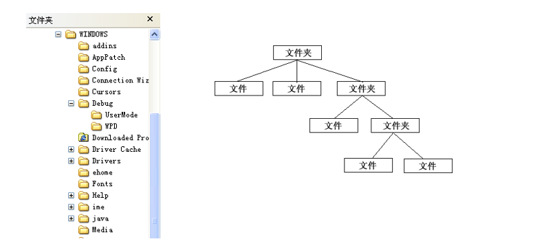
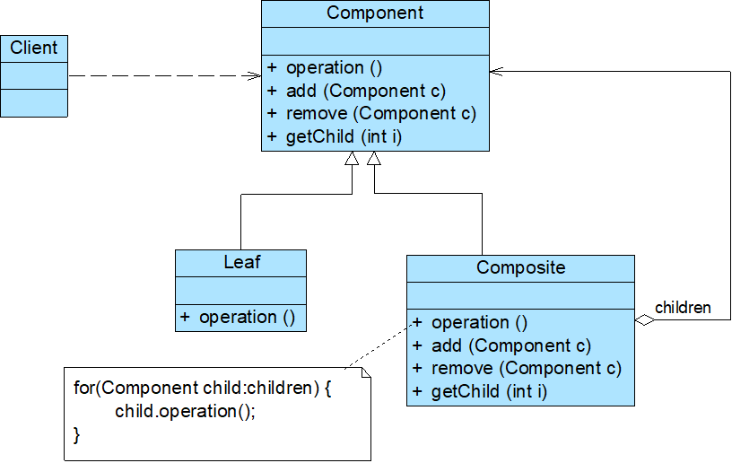
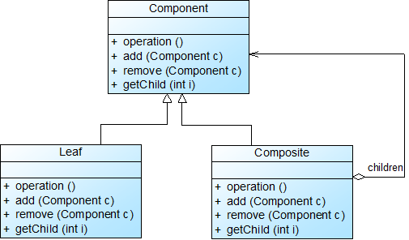
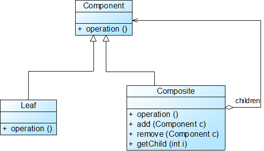
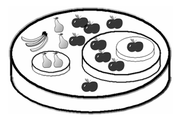
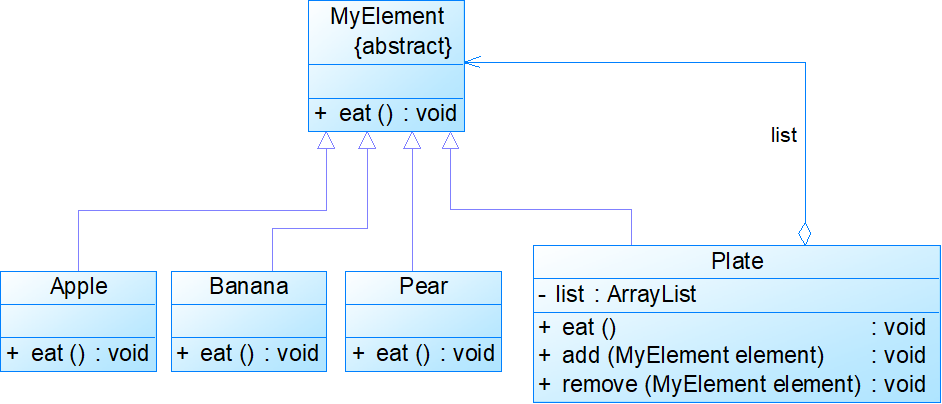

# 组合模式


<!--more-->

## 模式动机

- 在树形目录结构中，包含文件和文件夹两类不同的元素

  - 在文件夹中可以包含文件，还可以继续包含子文件夹

  - 在文件中不能再包含子文件或者子文件夹

- 文件夹  <-->容器(Container)

- 文件  <-->叶子(Leaf)

- 如何将容器对象和叶子对象进行递归组合，使得用户在使用时无须对它们进行区分，可以一致地对待容器对象和叶子对象？ à **组合模式**



## 模式定义

- 组合模式(Composite Pattern)：组合多个对象形成树形结构以表示“部分-整体”的结构层次。组合模式对单个对象（即叶子对象）和组合对象（即容器对象）的使用具有一致性。
- 对象结构型模式
- 将对象组织到树形结构中，可以用来描述整体与部分的关系

## 模式结构



模式代码实例

```java
package com.composite;

public interface Component {
	//如果是叶子结点，则打印它的名称；
	//如果是容器结点，则打印它的名称，并利用foreach语句调用每个子结点的operation方法
	public void operation();
	
	//添加一个子节点
	public void add(Component c);
	
	//删除一个子节点
	public void remove(Component c);
	
	//获取一个子结点
	public Component getChild(int i);
}

```

```java
package com.composite;

public class Leaf implements Component {
	public String leafname;
	
	public Leaf(String leafname) {
		this.leafname = leafname;
	}

	@Override
	public void operation() {
		// TODO Auto-generated method stub
		System.out.println("当前结点是叶子结点，叶子名称是 "+leafname);
	}

	@Override
	public void add(Component c) {
		// TODO Auto-generated method stub
		System.out.println("叶子结点不能执行add方法");
	}

	@Override
	public void remove(Component c) {
		// TODO Auto-generated method stub
		System.out.println("叶子结点不能执行remove方法");
	}

	@Override
	public Component getChild(int i) {
		// TODO Auto-generated method stub
		System.out.println("叶子结点不能执行getChild方法");
		return null;
	}

}

```

```java
package com.composite;

import java.util.ArrayList;

public class Composite implements Component {
	private String compositename;
	private ArrayList list=new ArrayList();
	
	public Composite(String compositename) {
		this.compositename = compositename;
	}

	@Override
	public void operation() {
		// TODO Auto-generated method stub
		System.out.println("当前结点是容器结点，容器名称是 "+compositename);
		for(Object child:list)
		{
			Component c=(Component)child;
			c.operation();
		}
	}

	@Override
	public void add(Component c) {
		// TODO Auto-generated method stub
		list.add(c);
		System.out.println("添加了一个子节点");
	}

	@Override
	public void remove(Component c) {
		// TODO Auto-generated method stub
		list.remove(c);
		System.out.println("删除了一个子节点");
	}

	@Override
	public Component getChild(int i) {
		// TODO Auto-generated method stub
		Component c=(Component)list.get(i);
		return c;
	}

}

```

```java
package com.composite;

public class Client {

	public static void main(String[] args) {
		// TODO Auto-generated method stub
		Component root=new Composite("C1-1");
		Component C21=new Composite("C2-1");
		Component L22=new Leaf("L2-2");
		Component C23=new Composite("C2-3");
		root.add(C21);
		root.add(L22);
		root.add(C23);
		Component C31=new Composite("C3-1");
		Component L32=new Leaf("L3-2");
		C21.add(C31);
		C21.add(L32);
		Component C33=new Composite("C3-3");
		Component C34=new Composite("C3-4");
		C23.add(C33);
		C23.add(C34);
		Component L41=new Leaf("L4-1");
		Component L42=new Leaf("L4-2");
		C31.add(L41);
		C31.add(L42);
		Component L43=new Leaf("L4-3");
		C33.add(L43);
		Component L44=new Leaf("L4-4");
		C34.add(L44);
		
		root.operation();
	}

}
```


## 模式分析

- 透明组合模式

  - 抽象构件Component中声明了所有用于管理成员对象的方法，包括add()、remove()，以及getChild()等方法

  - 在客户端看来，叶子对象与容器对象所提供的方法是一致的，客户端可以一致地对待所有的对象

  - 缺点是不够安全，因为叶子对象和容器对象在本质上是有区别的



- 安全组合模式
  - 抽象构件Component中没有声明任何用于管理成员对象的方法，而是在Composite类中声明并实现这些方法
  - 对于叶子对象，客户端不可能调用到这些方法
  - 缺点是不够透明，客户端不能完全针对抽象编程，必须有区别地对待叶子构件和容器构件




## 优点

- 可以清楚地定义分层次的复杂对象，表示对象的全部或部分层次，让客户端忽略了层次的差异，方便对整个层次结构进行控制
- 客户端可以一致地使用一个组合结构或其中单个对象，不必关心处理的是单个对象还是整个组合结构，简化了客户端代码
- 增加新的容器构件和叶子构件都很方便，符合开闭原则
- 为树形结构的面向对象实现提供了一种灵活的解决方案

## 缺点

- 在增加新构件时很难对容器中的构件类型进行限制

## 应用场景

- 在具有整体和部分的层次结构中，希望通过一种方式忽略整体与部分的差异，客户端可以一致地对待它们
- 在一个使用面向对象语言开发的系统中需要处理一个树形结构
- 在一个系统中能够分离出叶子对象和容器对象，而且它们的类型不固定，需要增加一些新的类型

## 实例

在水果盘(Plate)中有一些水果，如苹果(Apple)、香蕉(Banana)、梨子(Pear)，当然大水果盘中还可以有小水果盘，现需要对盘中的水果进行遍历（吃），当然如果对一个水果盘执行“吃”方法，实际上就是吃其中的水果。使用组合模式模拟该场景




