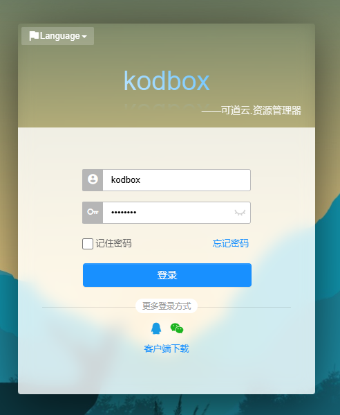
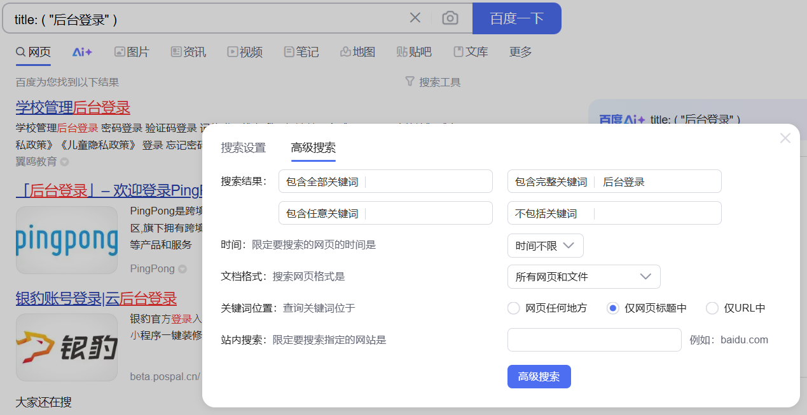
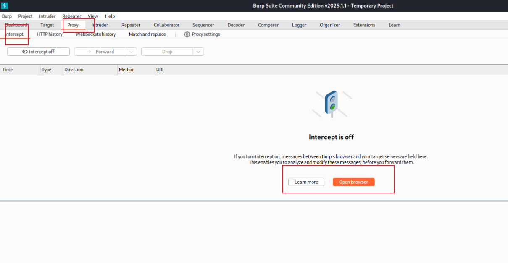
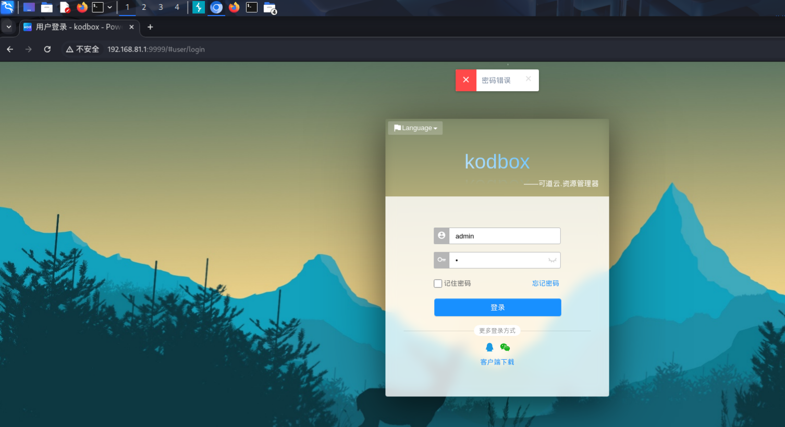
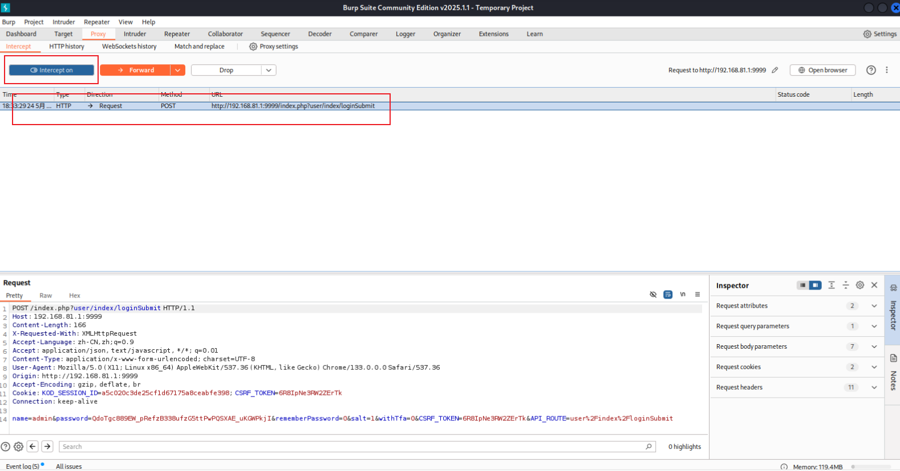
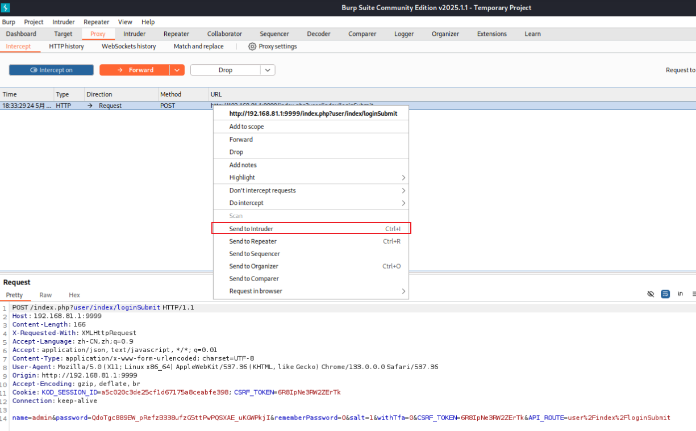
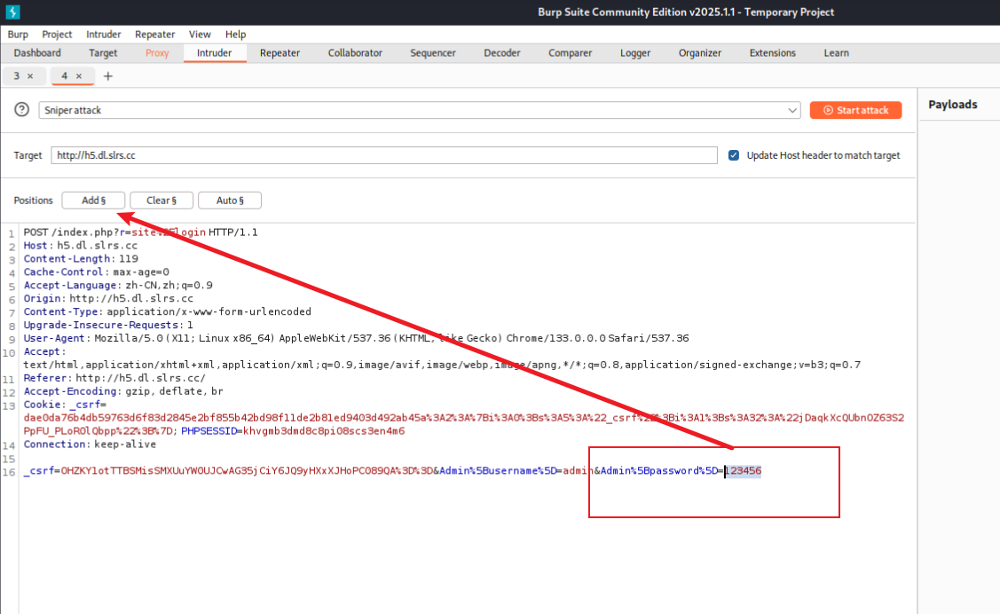
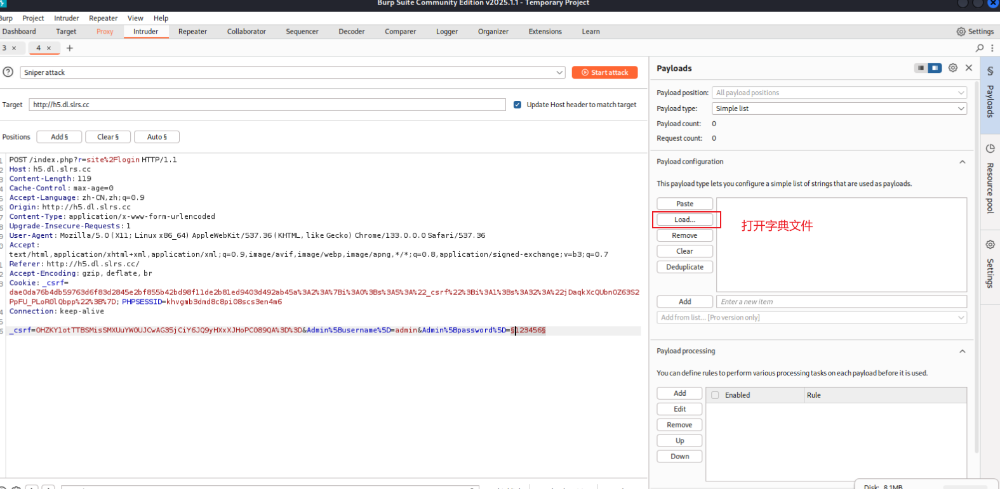
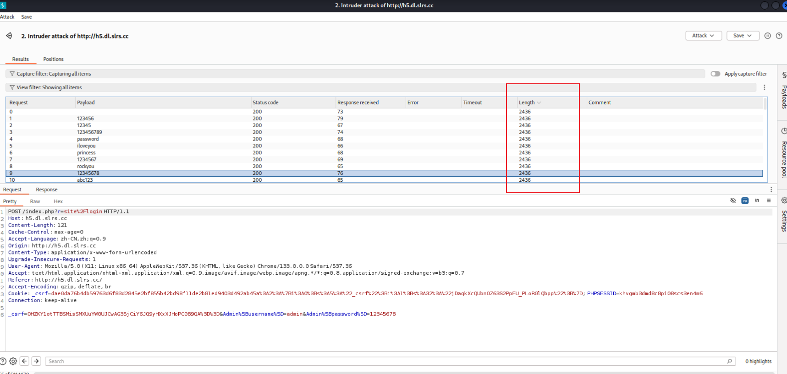

# 网站系统账户破解-BurpSuite

<!--more-->

遇到只需要账号和密码的地方，我们要用到破解技术，什么是破解技术呢?其实就是一个一个的去尝试不同的密码看看能不能登录进去

## Google Hacking

Google Hacking(谷歌黑客)是一种利用Google搜索引擎来查找可能存在安全漏洞或敏感信息的技术。黑客或安全研究人员通过使用特定的Google搜索命令和关键字，找到网站中意外暴露的文件、登录页面、数据库信息、配置文件等，可能导致安全漏洞的存在，当然百度也可以。

**所有政府网站不要搞**

## BurpSuite

Burp Suite 是一款常用于网络安全和渗透测试的综合性工具，它主要帮助安全研究人员、渗透测试人员和开发人员分析和测试 Web 应用程序的安全性。可以找漏洞、暴力破解、扫描等

1. 拦截代理(Proxy): 可以拦截、修改、重放客户端和服务器之间的 HTTP/S 流量，用于测试和调试请求
2. 扫描器(Scanner):自动化的漏洞扫描工具，如 SQL注入、跨站脚本攻击(XSS)等。
3. 爬虫(Crawler): 帮助自动发现和映射 Web 应用中的各个页面和功能，便于分析。
4. Intruder:用于执行自定义的渗透测试攻击，比如暴力破解、参数篡改等
5. Repeater:允许用户反复发送和修改 HTTP 请求，观察服务器响应，用于手动测试漏洞。
6. Comparer:对比两次响应的不同，帮助分析漏洞利用的效果。
7. Sequencer:用于测试随机数或会话令牌的随机性和安全性

### 字典

暴力破解中的字典，通常指的是一个包含大量预定义单词、密码或短语的列表，用于尝试登录或破解密码的过程。这种攻击方式称为字典攻击(DictionaryAttack)，"它通过使用字典中的每一个条目作为密码，逐一进行尝试，直到找到正确的密码为止。

### 暴力破解流程

#### 打开代理浏览器获得请求

proxy - > Intercept -> open brower

通过内置浏览器打开目标网站，模拟一个正常登录

拦截的请求（确保拦截开启）

#### 标记

发送到Intruder

选中标记，增加Payload

#### 暴力破解

选择字典

通过response的长度找到不同的请求响应找到正确的密码（不一定成功）

