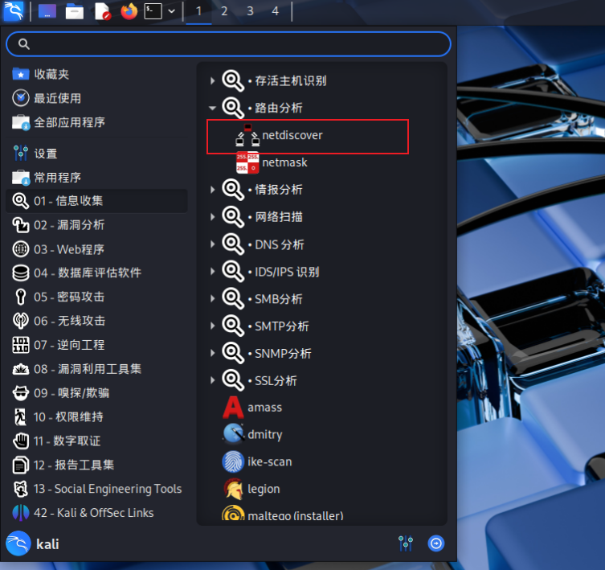
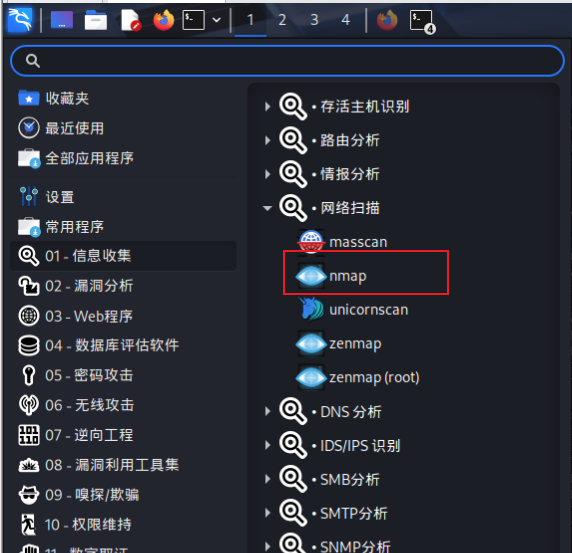

# 网络主机探测与识别-Netdiscover & nmap


<!--more-->



## Netdiscover

Netdiscover是一种网络扫描工具，通过ARP扫描发现活动主机，可以通过主动和被动两种模式进行ARP扫描。通过主动发送ARP请求检查网络ARP流量，通过自动扫描模式扫描网络地,这种扫描的方式在内网中不容易被别人发现。用于内网主机扫描。

### 基础常识

IP地址(Internet ProtocolAddress)是指互联网协议地址，又译为网际协议地址IP地址是IP协议提供的一种统一的地址格式，它为互联网上的每一个网络和每一台主机分配一个逻辑地址，以此来屏蔽物理地址的差异。


### 使用

```
Netdiscover 0.10 [Active/passive ARP reconnaissance tool]
Written by: Jaime Penalba <jpenalbae@gmail.com>

Usage: netdiscover [-i device] [-r range | -l file | -p] [-m file] [-F filter] [-s time] [-c count] [-n node] [-dfPLNS]
  -i device: your network device
  -r range: scan a given range instead of auto scan. 192.168.6.0/24,/16,/8
  -l file: scan the list of ranges contained into the given file
  -p passive mode: do not send anything, only sniff
  -m file: scan a list of known MACs and host names
  -F filter: customize pcap filter expression (default: "arp")
  -s time: time to sleep between each ARP request (milliseconds)
  -c count: number of times to send each ARP request (for nets with packet loss)
  -n node: last source IP octet used for scanning (from 2 to 253)
  -d ignore home config files for autoscan and fast mode
  -f enable fastmode scan, saves a lot of time, recommended for auto
  -P print results in a format suitable for parsing by another program and stop after active scan
  -L similar to -P but continue listening after the active scan is completed
  -N Do not print header. Only valid when -P or -L is enabled.
  -S enable sleep time suppression between each request (hardcore mode)

If -r, -l or -p are not enabled, netdiscover will scan for common LAN addresses.
```

1、扫描网段192.168.3.XX的主机

`sudo netdiscover -r 1992.168.3.0/24`

一定要在同一个网段，不同网段是扫描不到的，需要路由器防火墙特殊配置

比如本机ip是192.168.81.128， 有一台主机ip是192.168.2.5，两台主机属于不同网段，扫描不到

## NMAP



在Kali中可以使用NMAP工具进行扫描，可以检测目标**主机是否在线、端口开放情况、侦测运行的服务类型及版本信息、侦测操作系统与设备类型**等信息。

### 使用

```
Nmap 7.95 ( https://nmap.org )
Usage: nmap [Scan Type(s)] [Options] {target specification}
TARGET SPECIFICATION:
  Can pass hostnames, IP addresses, networks, etc.
  Ex: scanme.nmap.org, microsoft.com/24, 192.168.0.1; 10.0.0-255.1-254
  -iL <inputfilename>: Input from list of hosts/networks
  -iR <num hosts>: Choose random targets
  --exclude <host1[,host2][,host3],...>: Exclude hosts/networks
  --excludefile <exclude_file>: Exclude list from file
HOST DISCOVERY:
  -sL: List Scan - simply list targets to scan
  -sn: Ping Scan - disable port scan
  -Pn: Treat all hosts as online -- skip host discovery
  -PS/PA/PU/PY[portlist]: TCP SYN, TCP ACK, UDP or SCTP discovery to given ports
  -PE/PP/PM: ICMP echo, timestamp, and netmask request discovery probes
  -PO[protocol list]: IP Protocol Ping
  -n/-R: Never do DNS resolution/Always resolve [default: sometimes]
  --dns-servers <serv1[,serv2],...>: Specify custom DNS servers
  --system-dns: Use OS's DNS resolver
  --traceroute: Trace hop path to each host
SCAN TECHNIQUES:
  -sS/sT/sA/sW/sM: TCP SYN/Connect()/ACK/Window/Maimon scans
  -sU: UDP Scan
  -sN/sF/sX: TCP Null, FIN, and Xmas scans
  --scanflags <flags>: Customize TCP scan flags
  -sI <zombie host[:probeport]>: Idle scan
  -sY/sZ: SCTP INIT/COOKIE-ECHO scans
  -sO: IP protocol scan
  -b <FTP relay host>: FTP bounce scan
PORT SPECIFICATION AND SCAN ORDER:
  -p <port ranges>: Only scan specified ports
    Ex: -p22; -p1-65535; -p U:53,111,137,T:21-25,80,139,8080,S:9
  --exclude-ports <port ranges>: Exclude the specified ports from scanning
  -F: Fast mode - Scan fewer ports than the default scan
  -r: Scan ports sequentially - don't randomize
  --top-ports <number>: Scan <number> most common ports
  --port-ratio <ratio>: Scan ports more common than <ratio>
SERVICE/VERSION DETECTION:
  -sV: Probe open ports to determine service/version info
  --version-intensity <level>: Set from 0 (light) to 9 (try all probes)
  --version-light: Limit to most likely probes (intensity 2)
  --version-all: Try every single probe (intensity 9)
  --version-trace: Show detailed version scan activity (for debugging)
SCRIPT SCAN:
  -sC: equivalent to --script=default
  --script=<Lua scripts>: <Lua scripts> is a comma separated list of
           directories, script-files or script-categories
  --script-args=<n1=v1,[n2=v2,...]>: provide arguments to scripts
  --script-args-file=filename: provide NSE script args in a file
  --script-trace: Show all data sent and received
  --script-updatedb: Update the script database.
  --script-help=<Lua scripts>: Show help about scripts.
           <Lua scripts> is a comma-separated list of script-files or
           script-categories.
OS DETECTION:
  -O: Enable OS detection
  --osscan-limit: Limit OS detection to promising targets
  --osscan-guess: Guess OS more aggressively
TIMING AND PERFORMANCE:
  Options which take <time> are in seconds, or append 'ms' (milliseconds),
  's' (seconds), 'm' (minutes), or 'h' (hours) to the value (e.g. 30m).
  -T<0-5>: Set timing template (higher is faster)
  --min-hostgroup/max-hostgroup <size>: Parallel host scan group sizes
  --min-parallelism/max-parallelism <numprobes>: Probe parallelization
  --min-rtt-timeout/max-rtt-timeout/initial-rtt-timeout <time>: Specifies
      probe round trip time.
  --max-retries <tries>: Caps number of port scan probe retransmissions.
  --host-timeout <time>: Give up on target after this long
  --scan-delay/--max-scan-delay <time>: Adjust delay between probes
  --min-rate <number>: Send packets no slower than <number> per second
  --max-rate <number>: Send packets no faster than <number> per second
FIREWALL/IDS EVASION AND SPOOFING:
  -f; --mtu <val>: fragment packets (optionally w/given MTU)
  -D <decoy1,decoy2[,ME],...>: Cloak a scan with decoys
  -S <IP_Address>: Spoof source address
  -e <iface>: Use specified interface
  -g/--source-port <portnum>: Use given port number
  --proxies <url1,[url2],...>: Relay connections through HTTP/SOCKS4 proxies
  --data <hex string>: Append a custom payload to sent packets
  --data-string <string>: Append a custom ASCII string to sent packets
  --data-length <num>: Append random data to sent packets
  --ip-options <options>: Send packets with specified ip options
  --ttl <val>: Set IP time-to-live field
  --spoof-mac <mac address/prefix/vendor name>: Spoof your MAC address
  --badsum: Send packets with a bogus TCP/UDP/SCTP checksum
OUTPUT:
  -oN/-oX/-oS/-oG <file>: Output scan in normal, XML, s|<rIpt kIddi3,
     and Grepable format, respectively, to the given filename.
  -oA <basename>: Output in the three major formats at once
  -v: Increase verbosity level (use -vv or more for greater effect)
  -d: Increase debugging level (use -dd or more for greater effect)
  --reason: Display the reason a port is in a particular state
  --open: Only show open (or possibly open) ports
  --packet-trace: Show all packets sent and received
  --iflist: Print host interfaces and routes (for debugging)
  --append-output: Append to rather than clobber specified output files
  --resume <filename>: Resume an aborted scan
  --noninteractive: Disable runtime interactions via keyboard
  --stylesheet <path/URL>: XSL stylesheet to transform XML output to HTML
  --webxml: Reference stylesheet from Nmap.Org for more portable XML
  --no-stylesheet: Prevent associating of XSL stylesheet w/XML output
MISC:
  -6: Enable IPv6 scanning
  -A: Enable OS detection, version detection, script scanning, and traceroute
  --datadir <dirname>: Specify custom Nmap data file location
  --send-eth/--send-ip: Send using raw ethernet frames or IP packets
  --privileged: Assume that the user is fully privileged
  --unprivileged: Assume the user lacks raw socket privileges
  -V: Print version number
  -h: Print this help summary page.
EXAMPLES:
  nmap -v -A scanme.nmap.org
  nmap -v -sn 192.168.0.0/16 10.0.0.0/8
  nmap -v -iR 10000 -Pn -p 80
SEE THE MAN PAGE (https://nmap.org/book/man.html) FOR MORE OPTIONS AND EXAMPLES
```

#### nmap -O IP 探测操作系统

```
nmap -O 192.168.81.1

Starting Nmap 7.95 ( https://nmap.org ) at 2025-05-24 14:03 CST
Nmap scan report for 192.168.81.1
Host is up (0.00048s latency).
Not shown: 992 filtered tcp ports (no-response)
PORT     STATE SERVICE
80/tcp   open  http
135/tcp  open  msrpc
139/tcp  open  netbios-ssn
445/tcp  open  microsoft-ds
902/tcp  open  iss-realsecure
912/tcp  open  apex-mesh
5357/tcp open  wsdapi
9000/tcp open  cslistener
MAC Address: 00:50:56:C0:00:08 (VMware)
Warning: OSScan results may be unreliable because we could not find at least 1 open and 1 closed port
Device type: general purpose
Running (JUST GUESSING): Microsoft Windows 10|11|2019 (97%)
OS CPE: cpe:/o:microsoft:windows_10 cpe:/o:microsoft:windows_11 cpe:/o:microsoft:windows_server_2019
Aggressive OS guesses: Microsoft Windows 10 1803 (97%), Microsoft Windows 10 1903 - 21H1 (97%), Microsoft Windows 11 (94%), Microsoft Windows 10 1909 (91%), Microsoft Windows 10 1909 - 2004 (91%), Windows Server 2019 (91%), Microsoft Windows 10 1809 (91%), Microsoft Windows 10 20H2 (88%)
No exact OS matches for host (test conditions non-ideal).
Network Distance: 1 hop
```

#### nmap IP 扫描IP端口

```
nmap 192.168.81.1

Starting Nmap 7.95 ( https://nmap.org ) at 2025-05-24 14:11 CST
Nmap scan report for 192.168.81.1
Host is up (0.00058s latency).
Not shown: 992 filtered tcp ports (no-response)
PORT     STATE SERVICE
80/tcp   open  http
135/tcp  open  msrpc
139/tcp  open  netbios-ssn
445/tcp  open  microsoft-ds
902/tcp  open  iss-realsecure
912/tcp  open  apex-mesh
5357/tcp open  wsdapi
9000/tcp open  cslistener
MAC Address: 00:50:56:C0:00:08 (VMware)
```

#### nmap -sV IP 查看服务的版本

```
nmap -sV  192.168.81.1
Starting Nmap 7.95 ( https://nmap.org ) at 2025-05-24 14:14 CST                                                    
Nmap scan report for 192.168.81.1                                                                                  
Host is up (0.00066s latency).                                                                                     
Not shown: 992 filtered tcp ports (no-response)
PORT     STATE SERVICE         VERSION
80/tcp   open  http            nginx
135/tcp  open  msrpc           Microsoft Windows RPC
139/tcp  open  netbios-ssn     Microsoft Windows netbios-ssn
445/tcp  open  microsoft-ds?
902/tcp  open  ssl/vmware-auth VMware Authentication Daemon 1.10 (Uses VNC, SOAP)
912/tcp  open  vmware-auth     VMware Authentication Daemon 1.0 (Uses VNC, SOAP)
5357/tcp open  http            Microsoft HTTPAPI httpd 2.0 (SSDP/UPnP)
9000/tcp open  http            Apache Tomcat (language: en)
MAC Address: 00:50:56:C0:00:08 (VMware)
Service Info: OS: Windows; CPE: cpe:/o:microsoft:windows
```

#### nmap -P p1,p2 IP  扫描指定端口

```
nmap -p 80-1000 192.168.81.1                                                                                   
Starting Nmap 7.95 ( https://nmap.org ) at 2025-05-24 14:15 CST
Nmap scan report for 192.168.81.1
Host is up (0.00052s latency).
Not shown: 915 filtered tcp ports (no-response)
PORT    STATE SERVICE
80/tcp  open  http
135/tcp open  msrpc
139/tcp open  netbios-ssn
445/tcp open  microsoft-ds
902/tcp open  iss-realsecure
912/tcp open  apex-mesh
MAC Address: 00:50:56:C0:00:08 (VMware)
```

## VM网络模式

### **模式对比**‌

- ‌**NAT模式**‌：虚拟机通过主机转换IP上网，默认创建独立子网（如192.168.81.0）
- ‌**桥接模式**‌：虚拟机直接使用物理网络适配器，与主机共享同一网段（如192.168.2.0）
- ‌**仅主机模式**‌：完全隔离网络环境，仅支持虚拟机和主机通信

### 配置同一网段方案

#### 方案1：桥接模式直连（推荐）

1. 虚拟机设置：
   - 右键虚拟机 → 设置 → 网络适配器 → 选择「桥接模式」
   - 勾选「复制物理网络连接状态」（自动同步主机网卡）
2. 主机操作：

```sh
# Linux虚拟机静态IP配置示例（需root权限）
nmcli con modify ens33 ipv4.addresses 192.168.2.128/24
nmcli con modify ens33 ipv4.gateway 192.168.2.1
nmcli con up ens33
```

#### 方案2：NAT模式定制网段

1. 修改VMware虚拟网络配置：
   - 打开「虚拟网络编辑器」→ 选择「VMnet8（NAT模式）」
   - 设置子网IP为192.168.2.0 → 子网掩码255.255.255.0
   - 修改NAT设置中的网关为192.168.2.1
2. 主机虚拟网卡调整：
   - 打开「网络连接」→ 右键「VMnet8」→ 属性 → IPv4协议
   - 设置IP地址为192.168.2.1（需与虚拟机网关一致）

#### 方案3：静态路由互通（企业级方案）

1. 若存在三层交换机或路由器：

   - 在设备上添加静态路由：

     ```
     目标网段：192.168.81.0/24 → 下一跳：主机所在网关（如192.168.2.1）
     目标网段：192.168.2.0/24 → 下一跳：虚拟机所在网关（如192.168.81.1）
     ```

     
