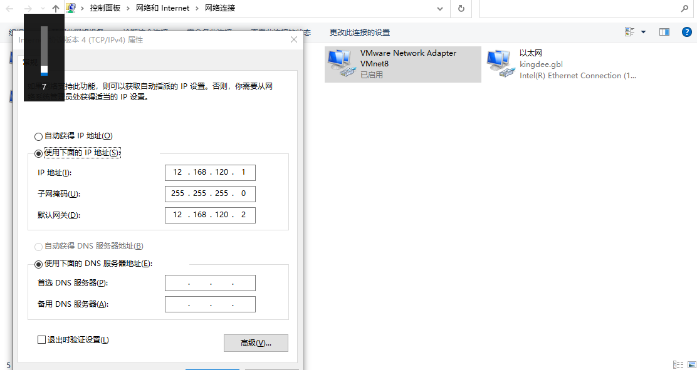

# 虚拟机网络配置


<!--more-->

虚拟机网络一般配置为net模式

要求：虚拟机网段与客户端网段不需要在同一网段内，所以没什么关系

上截图

```shell
ens33: flags=4163<UP,BROADCAST,RUNNING,MULTICAST>  mtu 1500
        inet 12.168.120.3  netmask 255.255.255.0  broadcast 12.168.120.255
        inet6 fe80::9e98:31b8:51e:9ffb  prefixlen 64  scopeid 0x20<link>
        ether 00:0c:29:8c:87:3f  txqueuelen 1000  (Ethernet)
        RX packets 113  bytes 15203 (14.8 KiB)
        RX errors 0  dropped 0  overruns 0  frame 0
        TX packets 120  bytes 14794 (14.4 KiB)
        TX errors 0  dropped 0 overruns 0  carrier 0  collisions 0

lo: flags=73<UP,LOOPBACK,RUNNING>  mtu 65536
        inet 127.0.0.1  netmask 255.0.0.0
        inet6 ::1  prefixlen 128  scopeid 0x10<host>
        loop  txqueuelen 1000  (Local Loopback)
        RX packets 0  bytes 0 (0.0 B)
        RX errors 0  dropped 0  overruns 0  frame 0
        TX packets 0  bytes 0 (0.0 B)
        TX errors 0  dropped 0 overruns 0  carrier 0  collisions 0
```

1、虚拟机IP：12.168.120.3 		网络掩码：255.255.255.0   	网关：12.168.120.2

客户端只需要设置VMnet8虚拟网络参数



