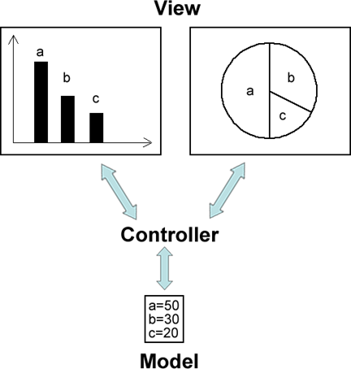
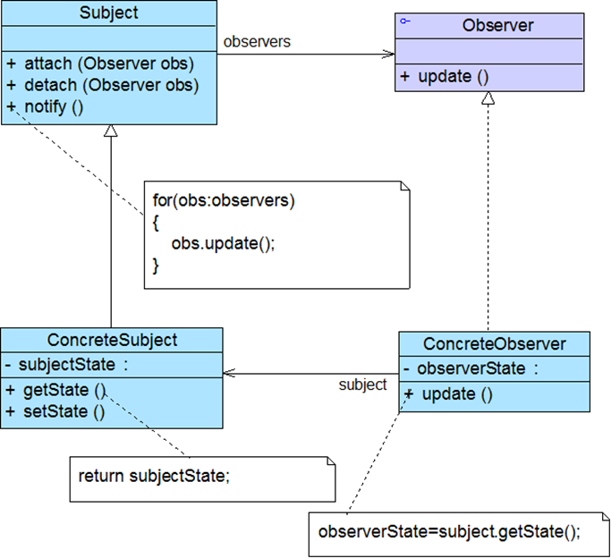
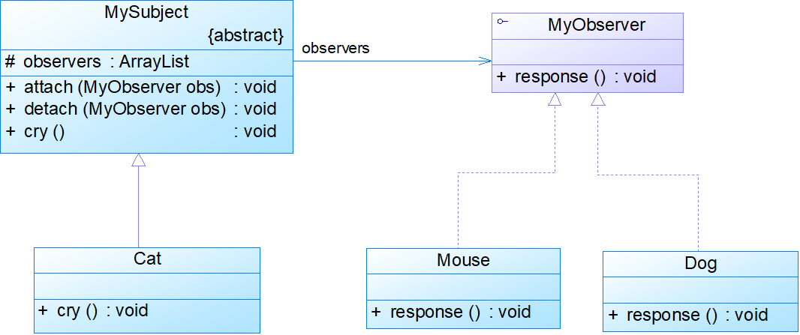

# 观察者模式


<!--more-->

## 模式动机



- 软件系统：一个对象的状态或行为的变化将导致其他对象的状态或行为也发生改变，它们之间将产生联动
- 观察者模式：

1. ​	定义了对象之间一种一对多的依赖关系，让一个对象的改变能够影响其他对象发生改变的对象称为观察目标，
2. ​	被通知的对象称为观察者
3. ​	一个观察目标可以对应多个观察者

## 模式定义

- 观察者模式(Observer Pattern)：定义对象间的一种一对多依赖关系，使得每当一个对象状态发生改变时，其相关依赖对象皆得到通知并被自动更新。
- 观察者模式又叫做发布-订阅（Publish/Subscribe）模式、模型-视图（Model/View）模式、源-监听器（Source/Listener）模式或从属者（Dependents）模式
- 观察者模式是一种对象行为型模式



代码：

```java
//抽象观察者
public interface Observer {
	public void update(Subject subject);
}
```

```java
public class ConcreteObserver implements Observer {
	private String observername;	//观察者名称
	private String observerstate;	//观察者状态
		
	public ConcreteObserver(String observername) {
		this.observername = observername;
	}

	@Override
	public void update(Subject subject) {
		// TODO Auto-generated method stub
		observerstate="观察者 "+observername+" 的当前状态是："+subject.getState();
		System.out.println(observerstate);
	}

}
```

```java
//抽象观察目标
public abstract class Subject {
	private String state;	//状态
	protected ArrayList observers=new ArrayList();	//观察者集合

	public String getState() {
		return state;
	}

	public void setState(String state) {
		this.state = state;
		System.out.println("观察目标的状态变为："+state);
	}
	
	public void attach(Observer observer)
	{
		observers.add(observer);
	}
	
	public void detach(Observer observer)
	{
		observers.remove(observer);
	}
	
	public abstract void notifyObservers();
}

```

```java
public class ConcreteSubject extends Subject {

	@Override
	public void notifyObservers() {
		// TODO Auto-generated method stub
		System.out.println("具体观察目标：通知所有观察者");
		for(Object obj:observers)
		{
			Observer observer=(Observer)obj;
			observer.update(this);
		}
	}

}

```

```java
public class Client {

	public static void main(String[] args) {
		// TODO Auto-generated method stub
		Subject subject=new ConcreteSubject();
		Observer obsA=new ConcreteObserver("obsA");
		Observer obsB=new ConcreteObserver("obsB");
		subject.attach(obsA);
		subject.attach(obsB);

		System.out.println("--------------------");
		subject.setState("״̬1");
		subject.notifyObservers();
		
		System.out.println("--------------------");
		subject.setState("״̬2");
		subject.notifyObservers();

		System.out.println("--------------------");
		Observer obsC=new ConcreteObserver("obsC");
		subject.attach(obsC);
		subject.setState("״̬3");
		subject.notifyObservers();

		System.out.println("--------------------");
		subject.detach(obsB);
		subject.setState("״̬4");
		subject.notifyObservers();
	}

}
```


## 模式分析

- 有时候在具体观察者类ConcreteObserver中需要使用到具体目标类ConcreteSubject中的状态（属性），会存在关联或依赖关系
- 如果在具体层之间具有关联关系，系统的扩展性将受到一定的影响，增加新的具体目标类有时候需要修改原有观察者的代码，在一定程度上违背了开闭原则，但是如果原有观察者类无须关联新增的具体目标，则系统扩展性不受影响

## 优点

- 可以实现表示层和数据逻辑层的分离
- 在观察目标和观察者之间建立一个抽象的耦合
- 支持广播通信，简化了一对多系统设计的难度
- 符合开闭原则，增加新的具体观察者无须修改原有系统代码，在具体观察者与观察目标之间不存在关联关系的情况下，增加新的观察目标也很方便

## 缺点

- 将所有的观察者都通知到会花费很多时间
- 如果存在循环依赖时可能导致系统崩溃
- 没有相应的机制让观察者知道所观察的目标对象是怎么发生变化的，而只是知道观察目标发生了变化

## 应用场景

- 一个抽象模型有两个方面，其中一个方面依赖于另一个方面，将这两个方面封装在独立的对象中使它们可以各自独立地改变和复用
- 一个对象的改变将导致一个或多个其他对象发生改变，且并不知道具体有多少对象将发生改变，也不知道这些对象是谁
- 需要在系统中创建一个触发链

## 实例：

假设猫是老鼠和狗的观察目标，老鼠和狗是观察者，猫叫老鼠跑，狗也跟着叫，使用观察者模式描述该过程。



抽象目标类

```java
import java.util.ArrayList;

public abstract class Subject {
	protected ArrayList observers=new ArrayList();	//观察者集合
	
	protected String subjectState;	//观察目标自身的状态

	public String getSubjectState() {
		return subjectState;
	}

	public void setSubjectState(String subjectState) {
		this.subjectState = subjectState;
	}
	
	public abstract void attach(Observer obs);	//添加一个观察者
	public abstract void detach(Observer obs);	//删除一个观察者
	public void notifyObservers()	//通知所有观察者
	{
		for(Object obs:observers)
		{
			((Observer)obs).update(this);
		}
	}
	
}

```

具体目标类

```java
public class ConcreteSubject extends Subject {
	@Override
	public void attach(Observer obs) {	//添加观察者
		// TODO Auto-generated method stub
		observers.add(obs);
	}

	@Override
	public void detach(Observer obs) {	//删除观察者
		// TODO Auto-generated method stub
		observers.remove(obs);
	}

}

```

抽象观察者类：

```java
//抽象观察者
public interface Observer {
	//更新观察者当前自身的状态
	public void update(Subject subject); 
}

```

具体观察者1类：

```java
public class ConcreteObserver1 implements Observer {
	private String observerState="";
	
	@Override
	public void update(Subject subject) {
		// TODO Auto-generated method stub
		observerState=subject.getSubjectState();
		System.out.println("观察者1当前状态："+observerState);
	}

}
```

抽象观察者2类：

```java
public class ConcreteObserver2 implements Observer {
	private String observerState="";
	@Override
	public void update(Subject subject) {
		// TODO Auto-generated method stub
		observerState=subject.getSubjectState();
		System.out.println("观察者2当前状态："+observerState);
	}

}

```

客户端类：

```java
public class Client {

	public static void main(String[] args) {
		// TODO Auto-generated method stub
		Subject cs=new ConcreteSubject();
		cs.setSubjectState("状态1");
		ConcreteObserver1 obs1=new ConcreteObserver1();
		ConcreteObserver2 obs2=new ConcreteObserver2();
		
		cs.attach(obs1);
		cs.attach(obs2);
		System.out.println("观察目标初始状态："+cs.getSubjectState());
		System.out.println("其它观察者的状态：");
		cs.notifyObservers();
		
		System.out.println("-------------------");
		cs.setSubjectState("状态2");
		System.out.println("观察目标更新后状态："+cs.getSubjectState());
		System.out.println("其它观察者更新后的状态：");
		cs.notifyObservers();

		System.out.println("-------------------");
		cs.detach(obs2);
		cs.setSubjectState("状态3");
		System.out.println("观察目标更新后状态："+cs.getSubjectState());
		System.out.println("其它观察者更新后的状态：");
		cs.notifyObservers();
	}

}

```


