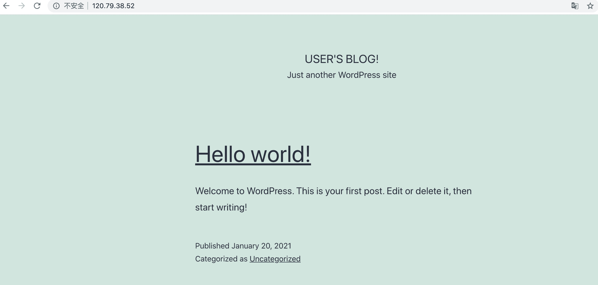
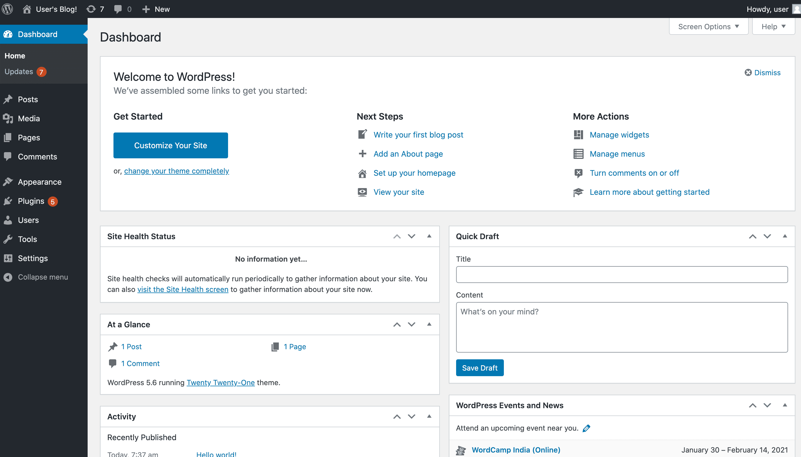

# 通过HelmCLI部署wordpress到ACK集群


<!--more-->

本实验，你将使用 Kubernetes 包管理工具 `helm` 部署一个 wordpress 应用到 ack 集群中，并通过 `LoadBalancer` 将部署的服务暴露出来由外部访问。

通过本实验，你将学习：

- Helm 命令的基本用法；

## Step 2 ：部署业务应用

首先，我们需要添加 WordPress 官方Repo地址：

```bash
helm3 repo add bitnami https://charts.bitnami.com/bitnami
```

执行 `Helm Install` 部署 WordPress：

```bash
helm3 install wordpress bitnami/wordpress \
    --set mariadb.primary.persistence.enabled=true \
    --set mariadb.primary.persistence.storageClass=alicloud-disk-ssd \
    --set mariadb.primary.persistence.size=20Gi \
    --set persistence.enabled=false
```

其中：

- 为了实现数据的持久化，mariadb 使用持久化存储卷保存数据；
- 持久化存储选用阿里云 ssd 云盘，大小为 20Gi，并通过配置 StorageClassName 自动化创建；
- WordPress 不需要进行数据持久化，数据卷选项可配置为 false

执行成功后，应该有如下返回：

```console
NAME: wordpress
LAST DEPLOYED: Wed Jan 20 15:09:45 2021
NAMESPACE: handsonack
STATUS: deployed
REVISION: 1
NOTES:
** Please be patient while the chart is being deployed **

Your WordPress site can be accessed through the following DNS name from within your cluster:

    wordpress.handsonack.svc.cluster.local (port 80)

To access your WordPress site from outside the cluster follow the steps below:

1. Get the WordPress URL by running these commands:

  NOTE: It may take a few minutes for the LoadBalancer IP to be available.
        Watch the status with: 'kubectl get svc --namespace handsonack -w wordpress'

   export SERVICE_IP=$(kubectl get svc --namespace handsonack wordpress --template "{{ range (index .status.loadBalancer.ingress 0) }}{{.}}{{ end }}")
   echo "WordPress URL: http://$SERVICE_IP/"
   echo "WordPress Admin URL: http://$SERVICE_IP/admin"

2. Open a browser and access WordPress using the obtained URL.

3. Login with the following credentials below to see your blog:

  echo Username: user
  echo Password: $(kubectl get secret --namespace handsonack wordpress -o jsonpath="{.data.wordpress-password}" | base64 --decode)
```

也可以通过以下命令查看部署状态：

```bash
helm3 status wordpress
```

## Step 3 ：访问 WordPress 应用

### 1. 获取访问地址

首先，我们需要找到刚才部署的 WordPress 的访问地址。

通过运行下面的命令来获取 WordPress 的 LoadBalancer 地址：

```bash
kubectl get svc wordpress
```

将获得如下的返回：

```console
NAME        TYPE           CLUSTER-IP     EXTERNAL-IP    PORT(S)                      AGE
wordpress   LoadBalancer   172.21.7.165   120.79.38.52   80:32034/TCP,443:31842/TCP   117s
```

其中的 `EXTERNAL-IP` 就是当前 WordPress 应用外网可访问的 IP 地址。

通过浏览器访问该 EXTERNAL-IP 地址，我们可以看到 WordPress 应用的首页：



### 2. 访问后台

为了能进入 WordPress 的后台，我们先要获取后台的用户名和密码。

前文的 `helm3 status wordpress` 命令的返回值已经给出了提示，访问后台的用户名就是 `user`。

而 `user` 用户的密码则需要通过下面的命令来获得：

```bash
kubectl get secret wordpress -o jsonpath="{.data.wordpress-password}" | base64 --decode
```

在终端的返回值中，你会看到类似下面的结果：

```console
TCEYTlASR8
```

这一段文本就是用户 user 的密码。

接着，我们需要通过地址 http://47.100.82.29/wp-admin/ 访问 WordPress 的后台：

其中的 `EXTERNAL-IP` 就是前文中获得的 WordPress 的 LoadBalancer 地址。

在浏览器访问后台地址，并输入用户名和密码会看到如下页面：



至此，WordPress 产品部署完成，并成功访问前台和后台。

## Step 4 ：删除 WordPress 应用

最后，通过 uninstall 命令删除部署的workpress：

```bash
helm3 uninstall wordpress
```
